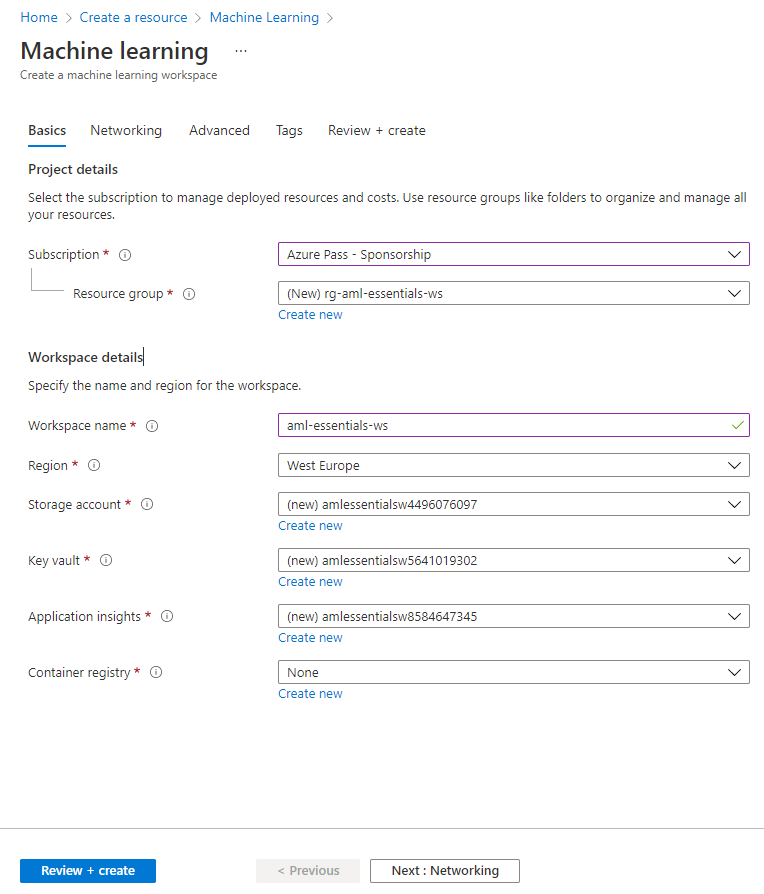
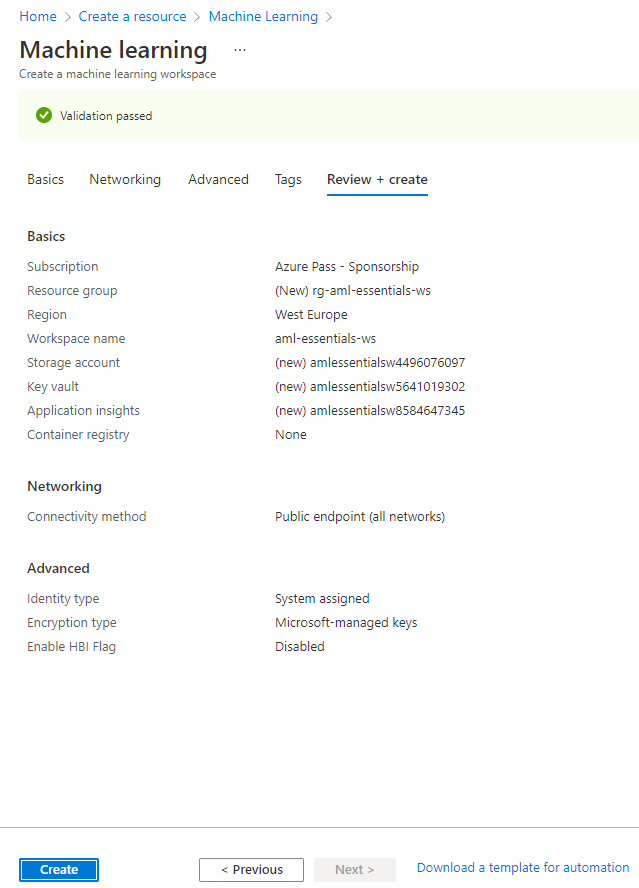
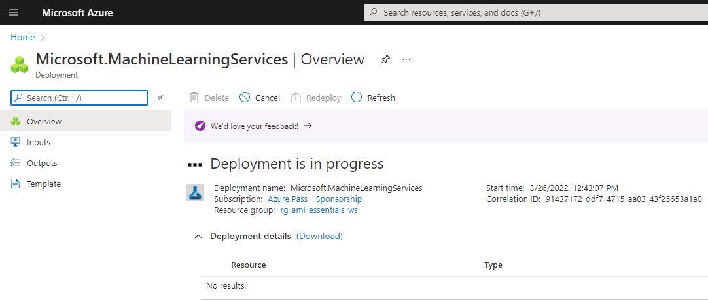
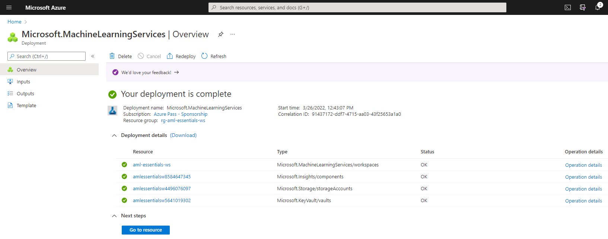
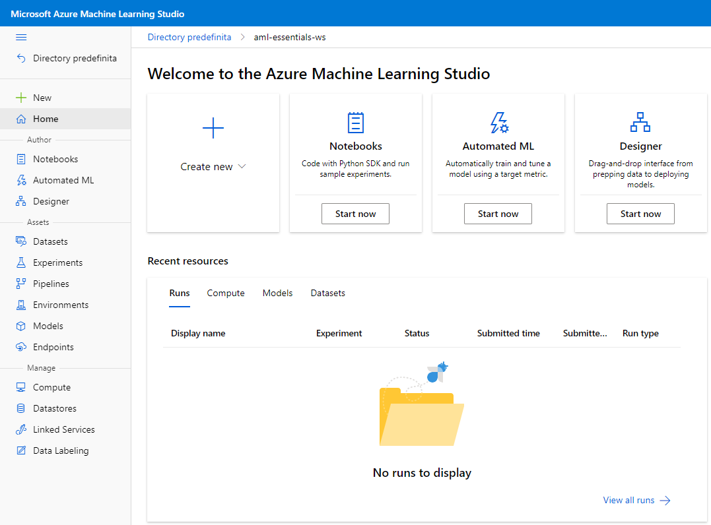

# Azure Machine Learning Lab 01

##  Create your AML Workspace

This exercise shows how to create an Azure ML studio workspace.  

We will use Azure portal to create workspace in this lab since the portal is the easiest way to get started with workspaces but as your needs change or requirements for automation increase you can also create and delete workspaces using the CLI, with Python code or via the VS Code extension.

## Tasks

1. Sign in to the Azure Portal by using the credentials for your Azure Subscription
2. In the search box, type **Machine Learning** and select the matching item

    

3. Then click create
   
   

4. Provide the following information to configure your workspace
      1. Subscription: Select the Azure subscription that you want to use.
      2. Resource group: Use an existing one in your subscription or enter a name to create a new one. In this example, we create a new one called **rg-aml-essentials-ws**. 
      3. Workspace name: Enter a unique name across the resource group. It is recommended to use a name which is easy to recall and differentiate from workspaces create by others. The name is case-insensitive. In this example we use **aml-essentials-ws**
      4. Region: Select the location closest to your users and data resources.
      5. Leave default values **Storage account**, **Key vault**, **Applications insights**, **Container registry**

    

5. Click **Review + Create**

6. In the *Validation page* click on **Create**
   
    

    The deployment will start

    

7. When the deployment is terminated click on **Go to resource**

    

8. In the Azure Machine Learning resource page click on **Launch studio**

    

    Azure Machine Learnig Studio home page will open in another tab of your browser

    

    The Lab is complete!

