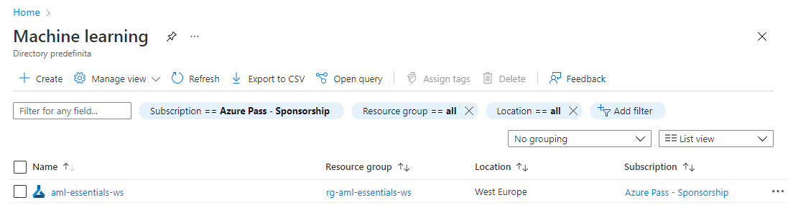
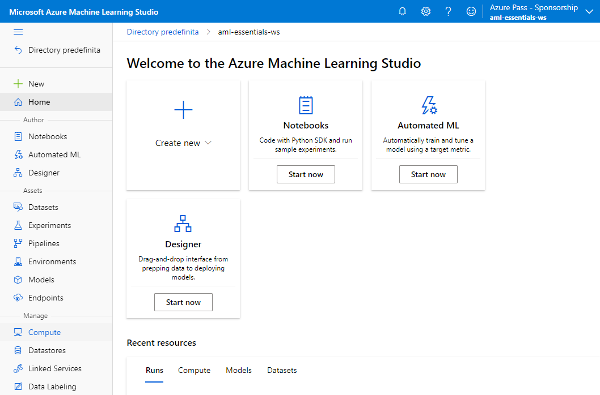
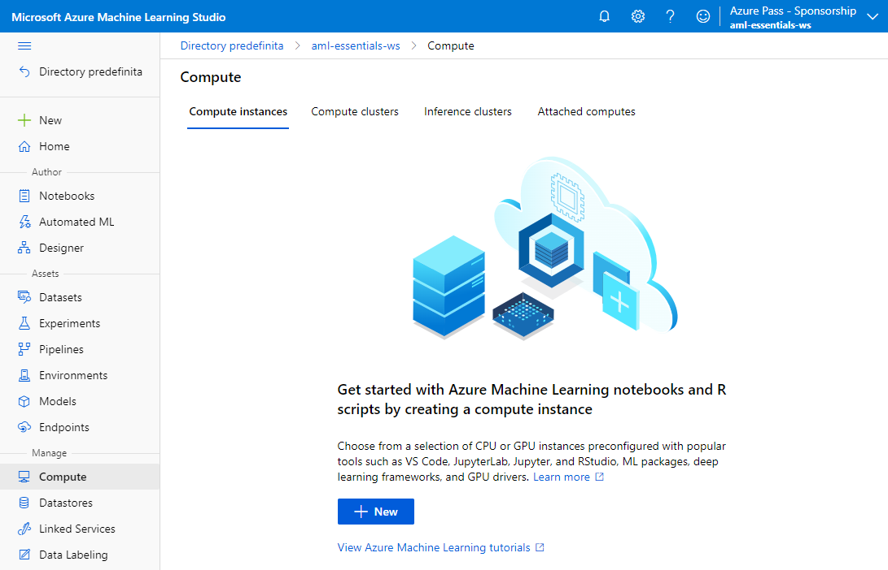
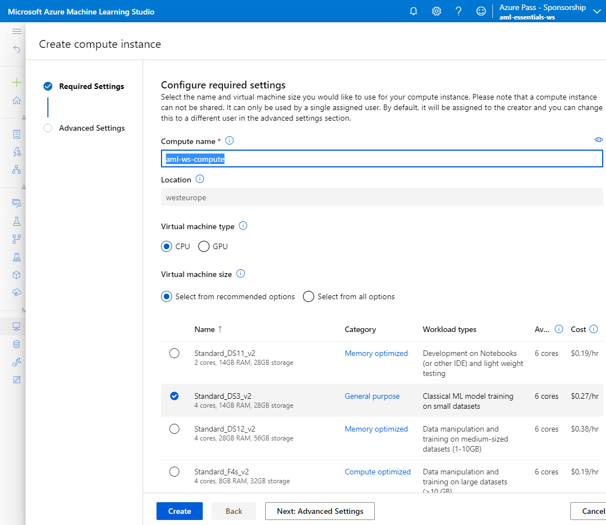
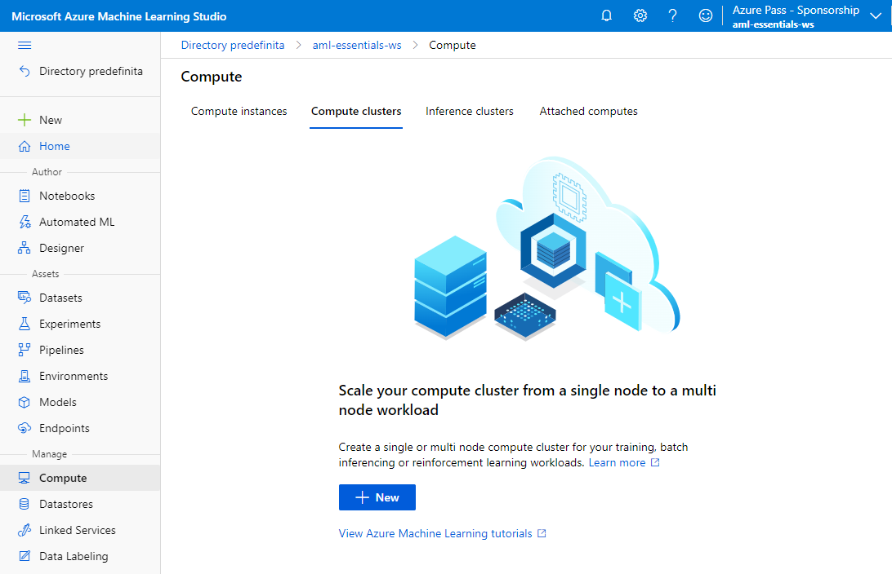
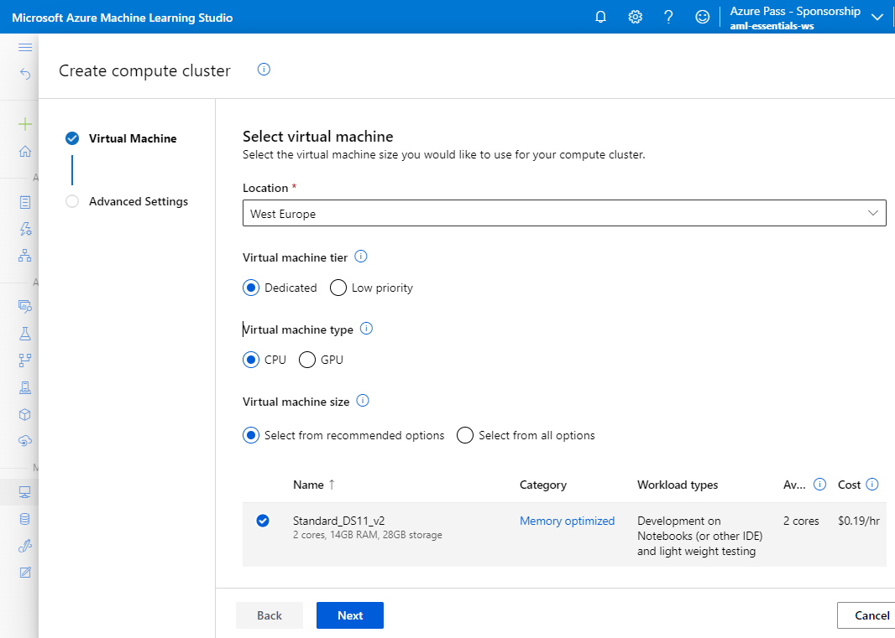
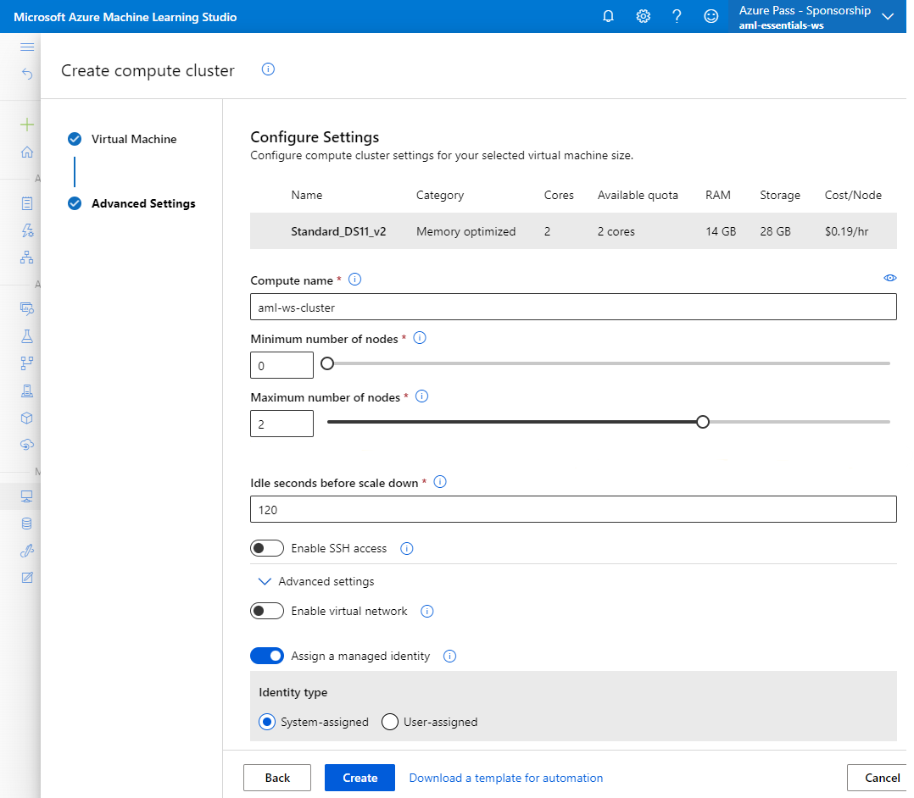

# Azure Machine Learning Lab 02

## Prerequisites

An existing Azure Machine Learning workspace. 

Please refer to the [Lab 1](../LabM01_01/README.md) for guidance on how to create it if needed.

## Create Compute Instance

The goal of this exercise is to create a compute instance in your Azure Machine Learning Workspace

### Tasks

1. Sign in to the Azure Portal by using the credentials for your Azure Subscription
2. Search for **Machine Learning** in the search bar at the top of the page and select the corresponding service

    

3. In the resulting click on the workspace you created and/or you want to use for the exercise (**aml-essentials-ws** in the example).

    

4. In the Azure Machine Learning resource page click on **Launch studio**

    

5. In the Azure Machine Learning Studio Page click on **compute** in the **manage** section of the menu

    

6. In the compute section select the **Compute Instances** tab and click on **+ New**

    

7. Provide the following information to configure your compute instance
      1. Compute name: enter a name for your compute instance. In this example we use **aml-ws-compute**)
      2. Location: **can't be changed**, the compute instance is always created in the same location as the Machine Learning service workspace. 
      3. Virtual machine type: select **CPU**
      4. Virtual machine size: select **Standard_DS3_v2**
      5. Click on create

    

    The exercise is complete!

## Create Compute Cluster

The goal of this exercise is to create a compute cluster in your Azure Machine Learning Workspace

1. Sign in to the Azure Portal by using the credentials for your Azure Subscription
2. Search for **Machine Learning** in the search bar at the top of the page and select the corresponding service

    

3. In the resulting click on the workspace you created and/or you want to use for the exercise (**aml-essentials-ws** in the example).

    

4. In the Azure Machine Learning resource page click on **Launch studio**

    

5. In the Azure Machine Learning Studio Page click on **compute** in the **manage** section of the menu

    

6. In the compute section select the **Compute clusters** tab and click on **+ New**

    

7. Provide the following information to configure your compute cluster
      1. Location: Select the location closest to your data resources (in this example we use **West Europe**)
      2. Virtual machine tier: select **Dedicated**
      3. Virtual machine type: select **CPU**
      4. Virtual machine size: select **Standard_DS11_v2**
      5. Click on **next**

    

8. Provide the following information in the Advanced Settings page
   1. Compute name: enter a name for your compute cluster. In this example we use **aml-ws-cluster**)
   2. Minimum number of nodes: insert 0
   3. Maximum number of nodes: insert 2
   4. Toggle the **Assign a managed identity** option in the **Advanced settings** subsection and select **System-assigned** as Identity type
   5. Click on **create**

    

    The Lab is complete!

