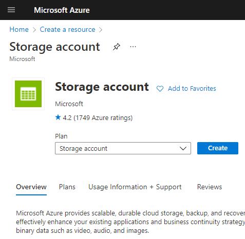
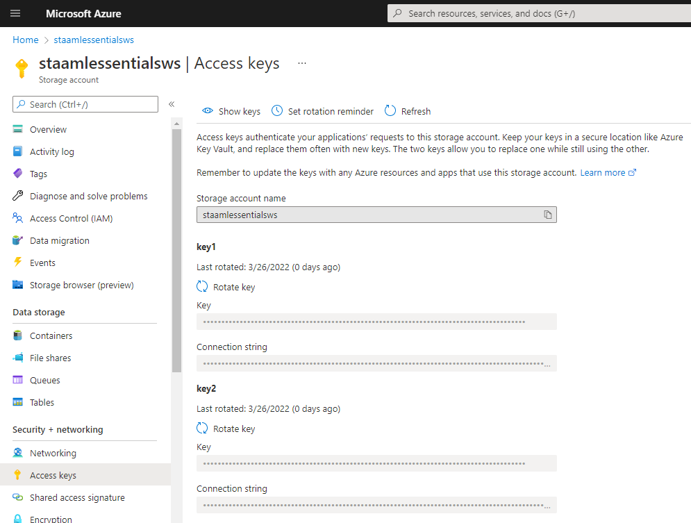

# Azure Machine Learning Lab 03

## Prerequisites

An existing Azure Machine Learning workspace. Please refer to the [Lab 1](../LabM01_01/README.md) for guidance on how to create it if needed.

## Create a Datastore

The goal of this exercise is to create a datastore to connect to an Azure Blob Storage 

### Step 1: Create Storage Account 

#### Tasks

1. Sign in to the Azure Portal by using the credentials for your Azure Subscription
2. In the search box, type **Storage account** and select the matching item

    

3. Then click create
   
   

4. Provide the following information to configure your Storage Account
      1. Subscription: Select the Azure subscription that you want to use.
      2. Resource group: Use an existing one in your subscription or enter a name to create a new one. In this example, we use the pre-existing **rg-aml-essentials-ws**. 
      3. Storage account name: Enter a globally unique name across the resource group. It is recommended to use a name which is easy to recall and differentiate from Storage account created by others. In this example we use **staamlessentialsws**
      4. Region: Select the location closest to your Azure Machine Learning worspace.
      5. Leave default values for the others parameters
      6. Click **Next: Advanced**

    

5. In the **Advanced** section check the option **Enable hierarchical namespace**

    

6. Click **Review + Create**

7. In the *Validation page* click on **Create**

8. When the deployment is terminated click on **Go to resource**

9. In the Storage account resource page click on **containers** under the *Data Storage* section on the left side menu

    

10. In the container section click on **+ Container**, write *data* in the name section and click on **create**
    
    

11. In the Storage account resource page click on **Access keys** under the *Security + networking* section on the left side menu

12. In the *Access keys* section click on **Show keys**

    

13. Copy the key1 and copy to a secure location for the next step

     

### Step 2: Create Datastore

1. Sign in to the Azure Portal by using the credentials for your Azure Subscription
2. Search for **Machine Learning** in the search bar at the top of the page and select the corresponding service

    

3. In the resulting click on the workspace you created and/or you want to use for the exercise (**aml-essentials-ws** in the example).

    

4. In the Azure Machine Learning resource page click on **Launch studio**

    

5. In the Azure Machine Learning Studio Page click on **datastores** in the **manage** section of the menu

    

6. In the datastore section click on **+ New datastore**

    

7. Provide the following information to configure your Datastore
   1. Datastore name: Enter a name to identify your datastore. In this example we are using **amlessentialsdata** 
   2. Datastore type: select **Azure Blob Storage**
   3. Account selection method: From Azure subscription
   4. Subscription ID: Select the Azure subscription where you created the Storage Account in the **Step 1**.
   5. Storage account: select the storage account created in the *Step 1*. In our case **staamlessentialsws**
   6. Blob container: select **data**
   7. Save credentials with the datastore for data access: select **Yes**
   8. Authentication type: select **Account key**
   9. Account key: use the storagea account key generated in the *Step 1*

     

8. Click on create

The Lab is complete!