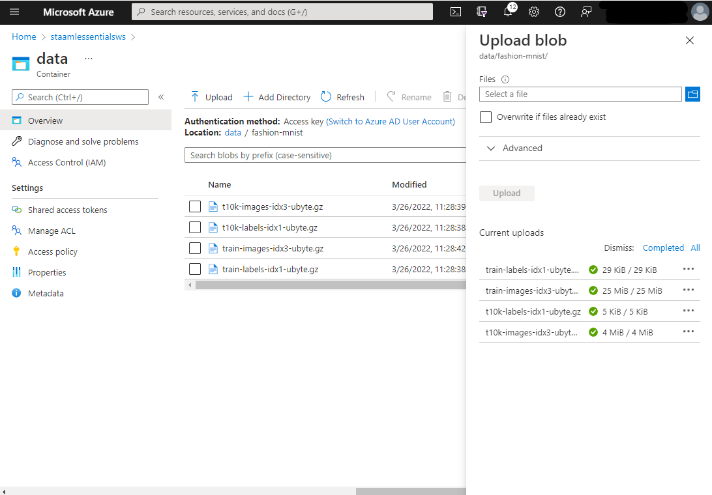
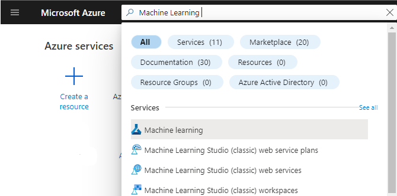
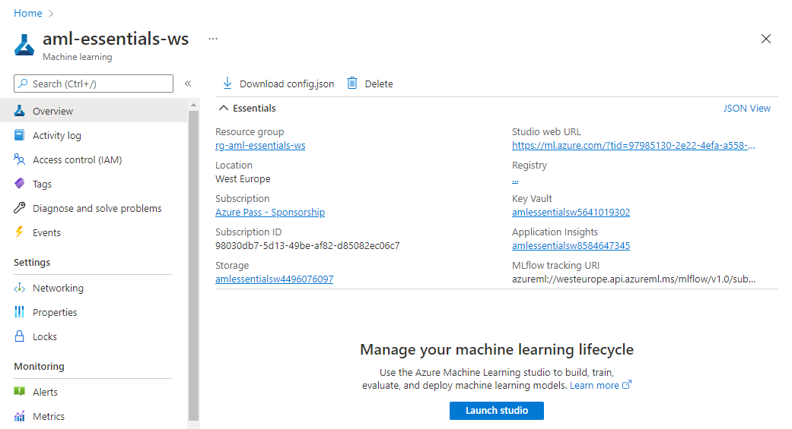
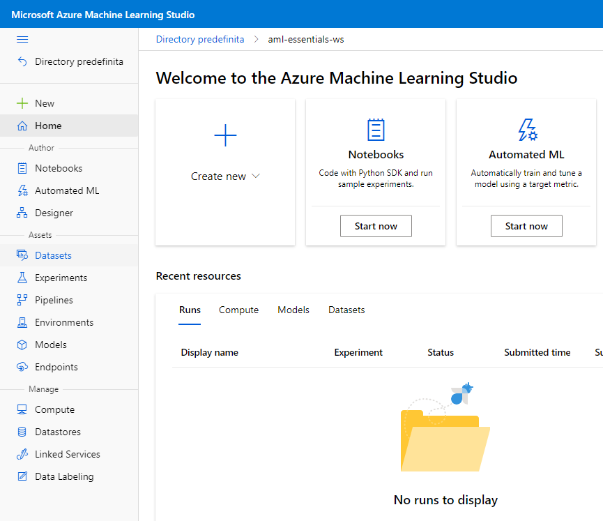
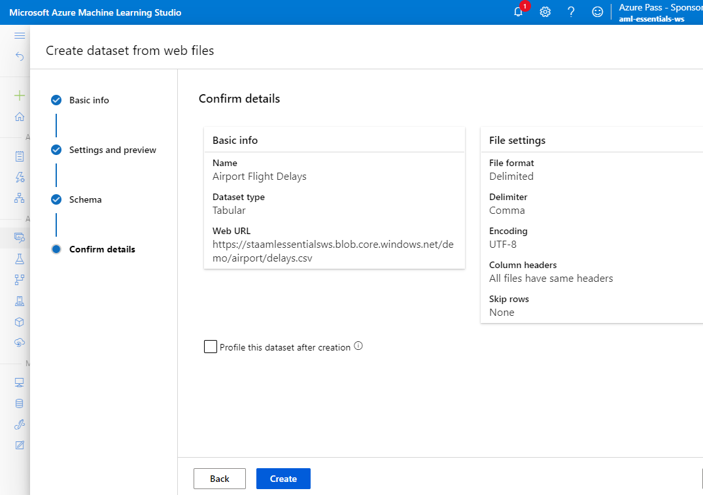

# Azure Machine Learning Lab 04

## Prerequisites

An existing Azure Machine Learning workspace. Please refer to the [Lab 1](../LabM01_01/README.md) for guidance on how to create it if needed.

A datastore where to upload data. Please refer to the [Lab 3] for guidance on how to create it if needed

## Create Datasets

The goal of this exercise is to create some datasets to use in your machine learning projects

### Create a File Dataset from the MNIST Fashion Dataset 

In this lab we will upload the [Fashion-MNIST](https://github.com/zalandoresearch/fashion-mnist) dataset into our Azure Blob Storage and we are going to register it as a FileDataset in our Azure Machine Learning workspace.

### Step 1

Upload Fashion-MNIST in your Azure Blob Storage

#### Tasks

1. Download the following files to your local environment
    - [t10k-labels-idx1-ubyte.gz](https://staamlessentialsws.blob.core.windows.net/demo/fashion-mnist/t10k-labels-idx1-ubyte.gz)
    - [t10k-images-idx3-ubyte.gz](https://staamlessentialsws.blob.core.windows.net/demo/fashion-mnist/t10k-images-idx3-ubyte.gz)
    - [train-images-idx3-ubyte.gz](https://staamlessentialsws.blob.core.windows.net/demo/fashion-mnist/train-images-idx3-ubyte.gz)
    - [train-labels-idx1-ubyte.gz](https://staamlessentialsws.blob.core.windows.net/demo/fashion-mnist/train-labels-idx1-ubyte.gz)

2. Open the storage account you created in the **Lab 3**
3. Click on **Containers** in the **Data Storage** section and then on the container **data**
4. Click on **+ Add Directory**, use **fashion-mist** as Name and click **Save**
    
5. Go into the newly created folder and click on **Upload**
6. Upload the file you downloaded in the step 1
    

### Step 2 

Create FileDataset in the Azure Machine Learning Workspace

#### Tasks

1. Sign in to the Azure Portal by using the credentials for your Azure Subscription
2. Search for **Machine Learning** in the search bar at the top of the page and select the corresponding service

    

3. In the resulting click on the workspace you created and/or you want to use for the exercise (**aml-essentials-ws** in the example).

    

4. In the Azure Machine Learning resource page click on **Launch studio**

    

5. In the Azure Machine Learning Studio Page click on **datasets** in the **Assets** section of the left-side menu

    

6. Click on **Create Dataset** and select **From datastore**

    

7. Provide the following information in the *Basic Info*
    1. Name: **fashion-mist**
    2. Dataset type: select **File**
    3. Click **Next**
   
    

8. Provide the following information in the *Datastore selection* 
    1. Select or create a datastore: select the datastore created in the *Lab 3*
    2. Path: select **fashion-mnist** folder 
    3. Click **next**

    

9. In the **Confirm details** click **Create**

    

### Create a Tabular Dataset from the 'Airport Codes Dataset' 

In this lab we will upload a dataset in cvs format containing codes of airport dataset into our Azure Blob Storage and we are going to register it as a TabularDataset in our Azure Machine Learning workspace.

### Step 1

Upload Fashion-MNIST in your Azure Blob Storage

#### Tasks

1. Download the following file to your local environment
    - [airport_codes_dataset.csv](https://staamlessentialsws.blob.core.windows.net/demo/airport/airport_codes_dataset.csv)
    
2. Open the storage account you created in the **Lab 3**
3. Click on **Containers** in the **Data Storage** section and then on the container **data**
4. Click on **+ Add Directory**, use **airport** as Name and click **Save**
    
5. Go into the newly created folder and click on **Upload**
6. Upload the file you downloaded in the step 1
    

### Step 2 

Create TabularDataset in the Azure Machine Learning Workspace

#### Tasks

1. Sign in to the Azure Portal by using the credentials for your Azure Subscription
2. Search for **Machine Learning** in the search bar at the top of the page and select the corresponding service

    

3. In the resulting click on the workspace you created and/or you want to use for the exercise (**aml-essentials-ws** in the example).

    

4. In the Azure Machine Learning resource page click on **Launch studio**

    

5. In the Azure Machine Learning Studio Page click on **datasets** in the **Assets** section of the left-side menu

    

6. Click on **+ Create Dataset** and select **From datastore**

    

7. Provide the following information in the *Basic Info*
    1. Name: **airport_codes**
    2. Dataset type: select **tabular**
    3. Click **Next**

9. Provide the following information in the *Datastore selection* step
    1. Select or create a datastore: select the datastore created in the *Lab 3*
    2. Path: select **airport/airport_codes_dataset.csv** folder 
    3. Click **next**

    

10. In the **Settings and preview** step leave the default values and click **next**

    

11. In the **Schema** step leave the default values and click **next**

    

12. In the **Confirm details** click **Create**

    

### Create a Tabular Dataset from   

In this lab we are going to create a TabularDataset from a Web URL
#### Tasks

1. Sign in to the Azure Portal by using the credentials for your Azure Subscription
2. Search for **Machine Learning** in the search bar at the top of the page and select the corresponding service

    

3. In the resulting click on the workspace you created and/or you want to use for the exercise (**aml-essentials-ws** in the example).

    

4. In the Azure Machine Learning resource page click on **Launch studio**

    

5. In the Azure Machine Learning Studio Page click on **datasets** in the **Assets** section of the left-side menu

    

6. Click on **+ Create Dataset** and select **From web files**

    

7. Provide the following information in the *Basic Info*
    1. Web URL: https://staamlessentialsws.blob.core.windows.net/demo/airport/delays.csv 
    2. Name: **Airport Flight Delays**
    3. Dataset type: select **tabular**
    4. Click **Next**

    

8.  In the **Settings and preview** step leave the default values and click **next**

    

9.  In the **Schema** step leave the default values and click **next**

    

10. In the **Confirm details** click **Create**

    
 
The lab is complete!