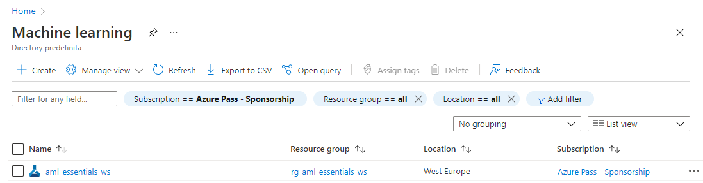
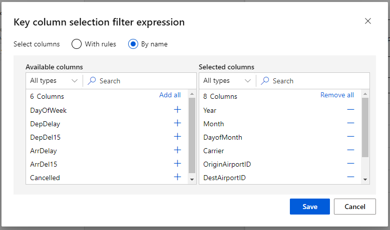
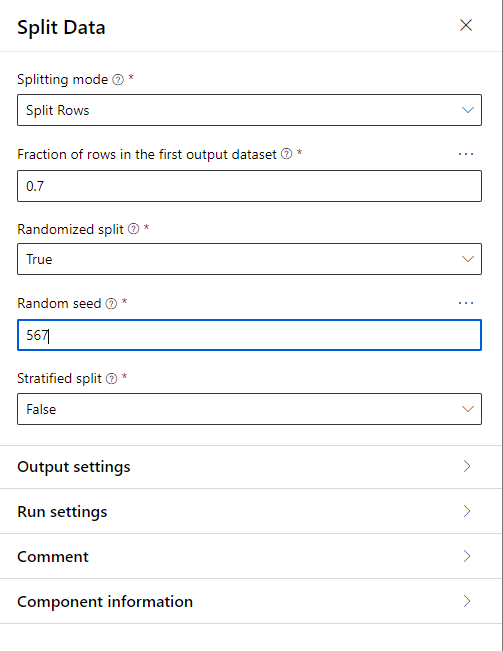

# Azure Machine Learning Lab 05

## Prerequisites

An existing Azure Machine Learning workspace. Please refer to the [Lab 1](../LabM01_01/README.md) for guidance on how to create it if needed.

A datastore where to upload data. Please refer to the [Lab 3] for guidance on how to create it if needed

## Create and deploy a regression model using the Azure Machine Learning Studio Designer

The goal of this exercise is to deploy a regression model that will predict if a passanger airplane will have delayed arrival.
We will start creating using *Linear Regression* and then we will try a *Boosted Decion Tree Regression*. We will finally select the better performin model and we will deploy it as a web service

### Create a Linear Regression Model

#### Tasks

1. Sign in to the Azure Portal by using the credentials for your Azure Subscription
2. Search for **Machine Learning** in the search bar at the top of the page and select the corresponding service

    

3. In the resulting click on the workspace you created and/or you want to use for the exercise (**aml-essentials-ws** in the example).

    

4. In the Azure Machine Learning resource page click on **Launch studio**

    

5. In the Azure Machine Learning Studio Page click on **Designer** in the **Author** section of the left-side menu

    

6. In the *Designer* session click on  **Easy-to-use prebuilt components**

    

7. In the automatically opened *Settings* window select the compute instance you created in [Lab 2](../LabM01_02/README.md)

    

8. From the *Asset Library*  click on *Dataset* and drag and drop the two datasets **Airport Flight Delays**, **airport_codes** to the canvas

    

9. From the **Asset Library** search *Join* 

    

10. Drag and Drop the **Join Data** module to the canvas 
11. Connect the output of **Airport Flight Delays** to the left input of the **Join Data** module
12. Connect the output of **airport_codes** to the left input of the **Join Data** module

    

13. Click the **Join Data** module to display the properties tab on the right

    

14.	Under **Join key columns for left dataset** click *Edit column* on the far right.
15.	In the window that opens, select By name and in the Available columns list find OriginAirportID and add it to the Selected columns list.

    

16.	Click *Edit column* for Join key columns for right dataset.
17.	In the window that opens, select By name and add airport_id to the Selected columns list.

    

18.	Set the remaining properties of the Join Data module as shown below:
    1. Match case: True
    2. Join type: Inner join
    3. Keep right key columns in joined table: False

    

19.	In the search box write  *remove duplicate rows*.

    

20.	Drag and drop the **Remove Duplicate Rows** module to the canvas.
21.	Connect the output of the **Join Data** module to the input of the **Remove Duplicate Rows** module.

  

22.	Click the **Remove Duplicate Rows** module to see its properties on the right side of the screen.
23.	For Key column selection filter expression field click Edit column.
24.	Add the following columns to the Selected columns list:
**Year**, **Month**, **DayofMonth**, **Carrier**, **OriginAirportID**, **DestAirportID**, **CRSDepTime**, **CRSArrTime**
*Note: In this case, two rows are considered duplicates of each other only if they have the same values in these eight columns.*

     

25.	In the search box write  *clean_missing_data*.

    

26.	Drag and drop the **Clean Missing Data** module to the canvas.
27.	Connect the output of the **Remove Duplicate Rows** module to the input of the **Clean Missing Data** module.

  

28.	Click the **Clean Missing Data** module to see its properties on the right side of the screen.

29. Click *Edit column* for **Columns to be cleaned** field

30. In the Columns to be cleaned dialog box, select With rules, and in the Include field select All columns.
    
    

31. Click **Save**

32. Set the *Cleaning mode* to **Remove entire row** and leave the remaining options at their default values.

     

33.	In the search box write  *select_columns*.

    

34.	Drag and drop the **Select Column in Dataset** module to the canvas.
35.	Connect the left output of the **Clean Missing Data** module to the input of the **Select Column in Dataset** module.

  

36.	Click the **Select Column in Dataset** module to see its properties on the right side of the screen.

37.  Click *Edit column* for **Select Columns** field

38.	In the Select columns window add the following columns:
**Month**, **DayofMonth**, **DayOfWeek**, **Carrier**, **OriginAirportID**, **DestAirportID**, **CRSDepTime**, **CRSArrTime**, **DepDelay**, **ArrDelay**

    
    
39.  Click **Save**
40.	In the search box write  *Normalize Data*.

    

41.	Drag and drop the ***Normalize Data** module to the canvas.
42.	Connect the output of the **Select Column in Dataset** module to the input of the **Normalize Data** module.

  

43.	Click the **Normalize Data** module to see its properties on the right side of the screen.

44. Click *Edit column* for **Columns to transform** field
45.	In the Select columns window add the following columns:
**CRSDepTime**, **DepDelay**, **CRSArrTime**

    

46. Click **Save**
47.	Set the remaining properties of the **Normalize Data Module** as shown below:
    1. Transformation method: ZScore
    2. Use 0 for constant columns when checked: True

    

<!--
Edit Metadata
-->

48.	In the search box write  *Edit Metadata*.

    

49.	Drag and drop the ***Edit Metadata** module to the canvas.
50.	Connect the left output of the **Normalized Data** module to the input of the **Edit Metadata** module.

  

51.	Click the **Edit Metadata** module to see its properties on the right side of the screen.

    +++++++++++++++++++++++++++++++

52.  Click *Edit column* for **Column** field
53.	In the Select columns window add the following columns:
**Carrier**, **OriginAirportID**, **DestAirportID**

    

54.  Click **Save**
55.	Set the remaining properties of the **Edit Metadata** as shown below:
    1. Data type: String
    2. Categorial: Categorical
    3. Fields: Unchanged
    4. New column name leave blank

    

<!--
Split Data
-->

56.	In the search box write *Split Data*.

    

57.	Drag and drop the ***Split Data** module to the canvas.
58.	Connect the  output of the **Edit Metadata** module to the input of the **Split Data** module.

    

59.	Click the **Split Data** module to see its properties on the right side of the screen.
60.	Set the properties of the **Split Data** as shown below:
    1. Fraction of rows n the first output dataset: 0.7
    2. Random seed: 567

    

<!--
Train Model
-->

61.	In the search box write *Train Model*.

    

62.	Drag and drop the ***Split Data** module to the canvas.
63.	Connect the  left output of the **Split Data** module to the right input of the **Train Model** module.

    

64.	Click the **Train Model** module to see its properties on the right side of the screen.
65. Click *Edit column* for **Label column** field
66.	Select the column **ArrDelay**

    

67. Click **Save**

<!-- 
Linear Regression
-->

68.  In the search box write *Linear Regression*.

    

69.	Drag and drop the ***Linear Regression** module to the canvas.

    

70. Connect the  output of the **Linear Regression** module to the left input of the **Train Model** module.
71.	Click the **Linear Regression** module to see its properties on the right side of the screen.

72.	Set the properties of the **Linear Regression** as shown below:
    1. Solution Method: **Ordinary Least Squares**
    2. L2 Regularization weight: **0.001**
    3. Include intercept term: **True**
    4. Random number seed: **567**

    

<!--
Score Model
-->

73. In the search box write *Score Model*.

      

74.	Drag and drop the ***Score Model** module to the canvas.
75. Connect the output of **Train Model** module to the left input of the **Score Model** module and the right output of the **Split Data** module to right input of the **Score Mode**

    
<!--
Evaluate Model
-->

76. In the search box write *Evaluate Model*.

      

77.	Drag and drop the ***Evaluate Model** module to the canvas.
78. Connect the output of **Score Model** module to the left input of the **Evaluate Model** 

    
  
79. Click on the **Submit** button on the top right of the interface
80. Set the properties of the **Pipeline Run** as shown below:
    1. Experiment: Create new
    2. New Experiment name: AirflightDelays
    3. Job Description: Example Regression for AML Workshop

    

81. Click **Submit**

82. Click on the **Evaluate Model** with the right button and select *Preview Data* -> *Evaluatiaon Results*

    

### Create a Boosted Decision Tree Regression Model

In this lab we are going to create a Boosted Decision Tree Regression Model and compare the Results with the Linear Regression model we built in the first step

#### Tasks

1. Double click on the **Train module** created during the previous Lab and type **Linear Regression Trained** in the comment box

    

2. Double click on the **Score Model** created during the previous Lab and type **Linear Regression Score** in the comment box

    

3. Copy and paste existing Train Model module and the Score Model module onto the canvas.  To do this, right-click the existing Train Model module, select Copy, then right-click on an open spot on the canvas and select Paste. Then click on the pasted module and move it to the desired location

4. Change the comments to **Boosted Decision Tree Regression Trained** and **Boosted Decision Tree Regression Score** respectively.

5. Connect the left input of **Split Data** module to the right input of the **Boosted Decision Tree Train Model** module

6. Connect the output of the **Boosted Decision Tree Train Model** module to the left input of the **Boosted Decision Tree Score Model** module

7. Connect the right output of **Split Data** module to right input of the  **Boosted Decision Tree Train Model** module

8. Connect the output of the **Boosted Decision Tree Score Model** module o the left input of the **Evaluate Model** module

   

9. In the search box write *Boosted Decision Tree Regression *.

     

10.	Drag and drop the ***Boosted Decision Tree Regression** module to the canvas.
11. Connect the output of **Boosted Decision Tree Regression** module to the left input of the **Boosted Decision Tree Regression Trained** 
12.	Click the ***Boosted Decision Tree Regression** module to see its properties on the right side of the screen.
13.	Set the properties of the ***Boosted Decision Tree Regression** as shown below:
    1. Create trainer mode: **SingleParameter**
    2. Maximum number of leaves per tree: **20**
    3. Minimum number of samples per leaf node: **10**
    4. Learning Rate: **0.2**
    5. Total number of trees constructed: **100**
    6. Random number seed: **567**

      
    
14. Click on **Submit**. Leave **Select Existing** experiment option checked. Wait for the run to complete

15. Click on the **Evaluate Model** with the right button and select *Preview Data* -> *Evaluatiaon Results*

    

16. From the comparison we can see that the new model is slighly better of the previous one

    

17. Delete the **Linear Regression** module
18. Delete the **Linear Regression Train Model** module 
19. Delete the **Linear Regression Score Model** module 
20. Connect the output of the **Boosted Decision Tree Score Model* module to the left input of the *Evaluate Model* module

    

### Deploy the model as Web Service

#### Tasks

1. Click **Create Inference Pipeline** button in the upper right area of the screen and select **Real-time Inference Pipeline**
   
    

   After setting up the web service you will see another tab **Real-time Inference Pipeline**

    

2. Remove the left **Web service input**
3. Remove the connection of the right **Web Service Input** to the **Join Data** Module
4. Connect the **Web Service Input** to the **Score Model** module

    

5. Remove the connection between the **Edit Metadata** module and the **Score Model** module

    

6. Search and drag a **Select Columns in Dataset** module onto the canvas
7. Connect the output of the **Edit Metadata** to the input of **Selected Columns in Dataset**
8. Connect the output of the **Select Columns in Dataset** module to the right input of the **Score Model** model

     

9.	Click the **Select Column in Dataset** module to see its properties on the right side of the screen.

    

10.  Click *Edit column* for **Select Columns** field

11.	In the Select columns window add the following columns:
**Month**, **DayofMonth**, **DayOfWeek**, **Carrier**, **OriginAirportID**, **DestAirportID**, **CRSDepTime**, **CRSArrTime**, **DepDelay**

    

12. Remove the connection between the **Score Model** module and the **Web service output**

    

13. Search and drag a **Select Columns in Dataset** module onto the canvas
14. Connect the output of the **Score Model** to the input of **Selected Columns in Dataset**
15. Connect the output of the **Selected Columns in Dataset** to the input of **Web service output**

    

16.	Click the **Select Column in Dataset** module to see its properties on the right side of the screen.

    

17. Click *Edit column* for **Select Columns** field
18.	In the Select columns window add the following columns: **Scored Labels**
19. Remove the **Evalute model** module
20. Click on **Submit** in the upper right of the screen
21. Set the properties of the **Pipeline Run** as shown below:
    1. Experiment: Create new
    2. New Experiment name: RegressionInferenceWebService
    
    

22. When complete, click **Deploy** in the upper right area of the Screen
    
    

23. Enter a name for the deployment, for example, **delayregression-deployment**. In the *Compute type field*, select **Azure Container Instance.**

    

24. Click **Deploy**

The lab is complete!