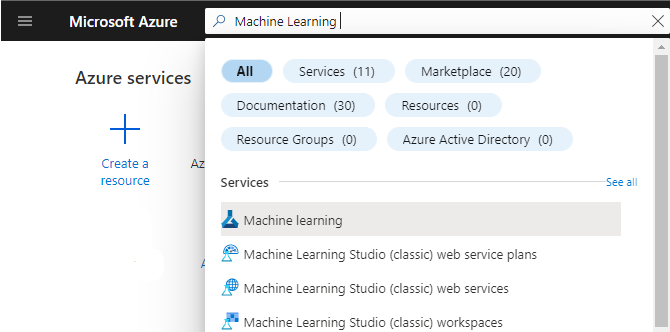
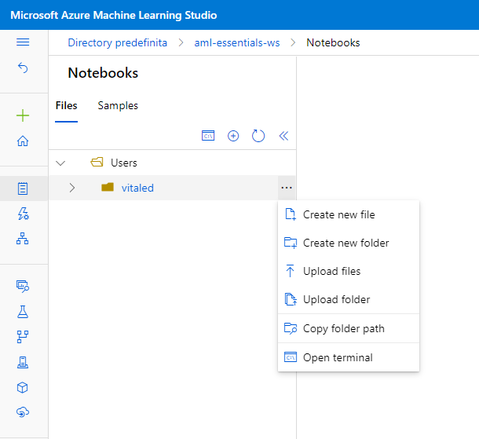
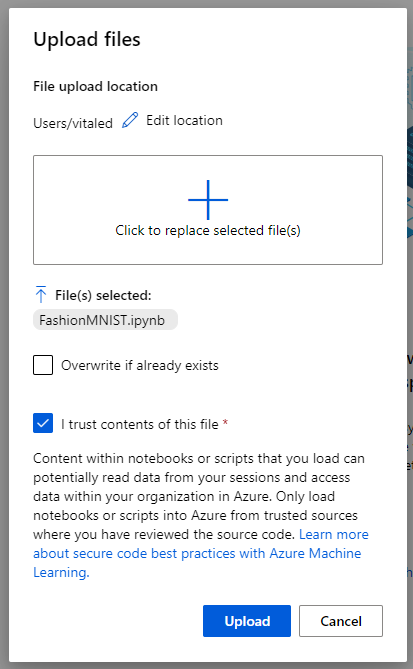
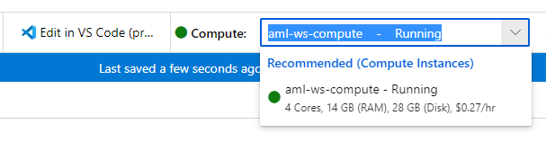
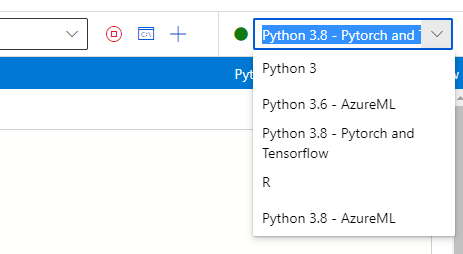
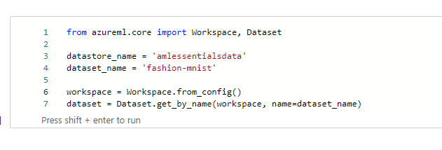
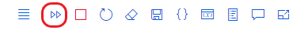
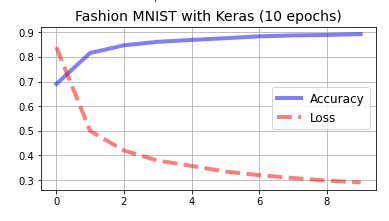
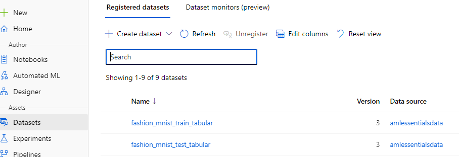

# Azure Machine Learning Lab 06

## Prerequisites

An existing Azure Machine Learning workspace. Please refer to the [Lab 1](../LabM01_01/README.md) for guidance on how to create it if needed.

A datastore where to upload data. Please refer to the [Lab 3] for guidance on how to create it if needed

## Train a model using a Notebook in Azure Machine Learning

### Tasks

1. Sign in to the Azure Portal by using the credentials for your Azure Subscription
2. Search for **Machine Learning** in the search bar at the top of the page and select the corresponding service

    

3. In the resulting click on the workspace you created and/or you want to use for the exercise (**aml-essentials-ws** in the example).

    

4. In the Azure Machine Learning resource page click on **Launch studio**

    

5. In the Azure Machine Learning Studio Page click on **Notebook** in the **Author** section of the left-side menu

     

6. In the notebook page click on the three dots close to your home directory and click on upload file

    

7. Select the file **FashionMNIST.ipynb** and check the flag *I trust content of this file*

     

A new notebook will open automatically in the browser

8. Select the compute instance that you created in the [Lab 2](../LabM01_02/)
   
    

9. Select *Python 3.8 - Pytorch and Tensorflow* as kernel

     

10. In the first block of the notebook change *datastore_name* and *dataset_name* with the name of the datastore and dataset  that you created respectively in the [Lab 3](../LabM01_03/README.md) and and [Lab 4](../LabM01_04/README.md). In our example **amlessentialsdata** and **fashion-mnist**

     

11. Execute the notebook by clicking on the **run all** command

     

    The expecte output should be:

    

12. Click on **datasets** in the **assets** secition on the left menu
    You should see the newly created datasets in the list

    

The lab is completed

