# Azure Machine Learning Lab 07

## Prerequisites

An existing Azure Machine Learning workspace. Please refer to the [Lab 1](../LabM01_01/README.md) for guidance on how to create it if needed.

A datastore where to upload data. Please refer to the [Lab 3] for guidance on how to create it if needed

### Use AutoML to solve a classification problem

#### Tasks

1. Sign in to the Azure Portal by using the credentials for your Azure Subscription
2. Search for **Machine Learning** in the search bar at the top of the page and select the corresponding service

    

3. In the resulting click on the workspace you created and/or you want to use for the exercise (**aml-essentials-ws** in the example).

    

4. In the Azure Machine Learning resource page click on **Launch studio**

    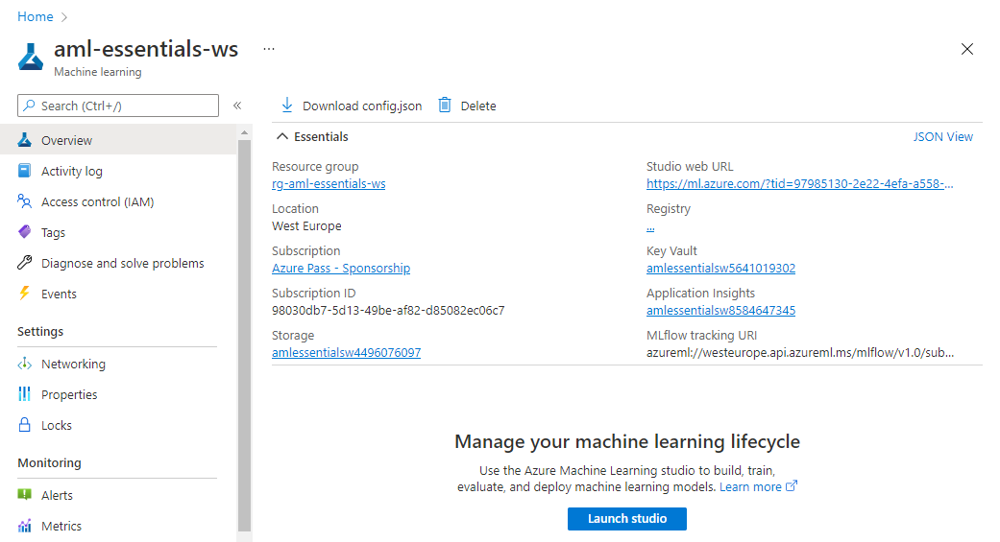

5. In the Azure Machine Learning Studio Page click on **Automated ML** in the **Author** section of the left-side menu

6. Click on **+ New Automated ML run** 

    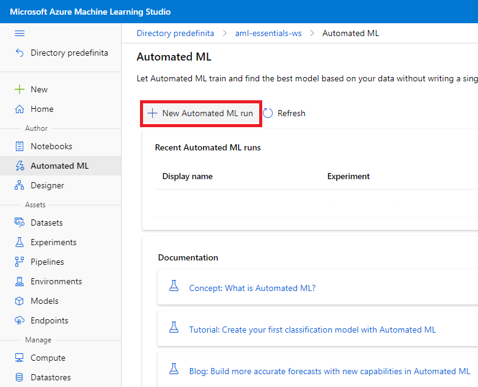

7. In the wizard click on **+ Create Dataset** -> **From Local Files**

    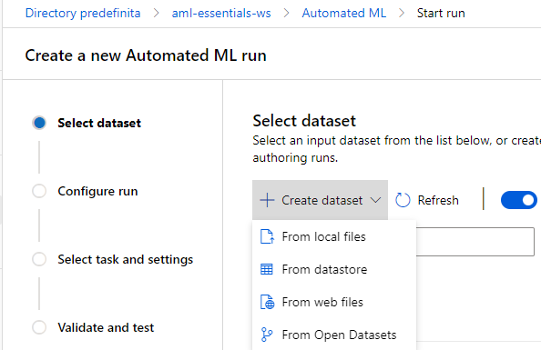

8. In the *basic* tab  provide the following information:
    1. Name: bankmarketing
    
    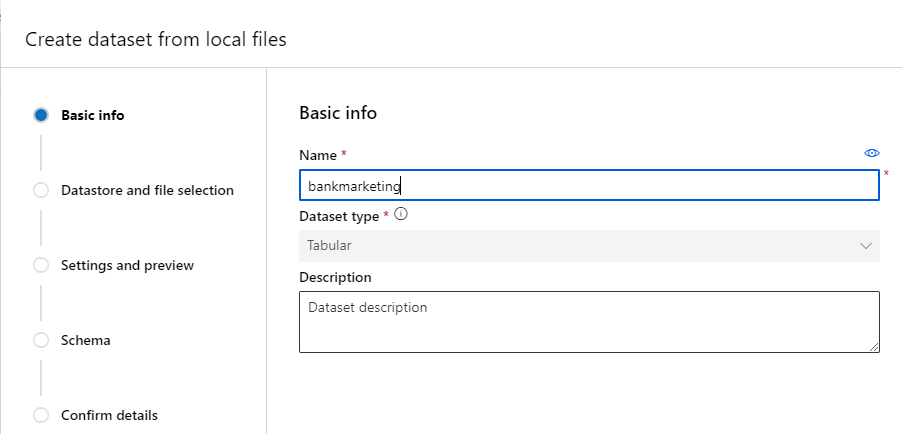

9. Click **next**   

10. In the *Datastore and file selection* tab  provide the following information:
    1. Select or create a datastore: select the datastore you created in the [Lab 2](../LabM01_02/README.md)
    2. Select file for your dataset: click on browse and select the file *bankmarketing_train.csv*
    
    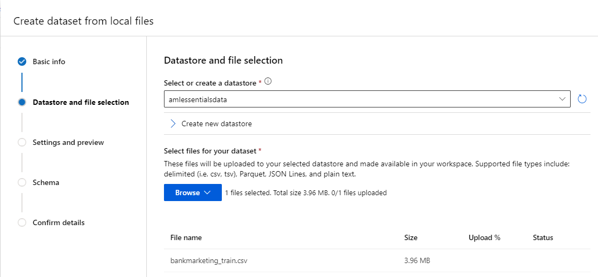

11. Click **next**
12. In the **Setting and preview** tab leave the default values and click **next**

    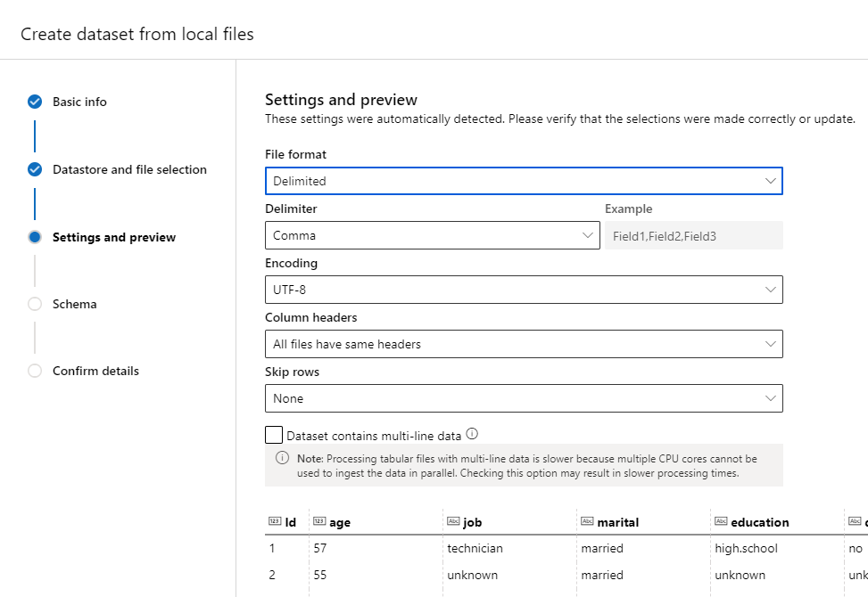

13. In the **Schema** tab leave the default values and click **next**

    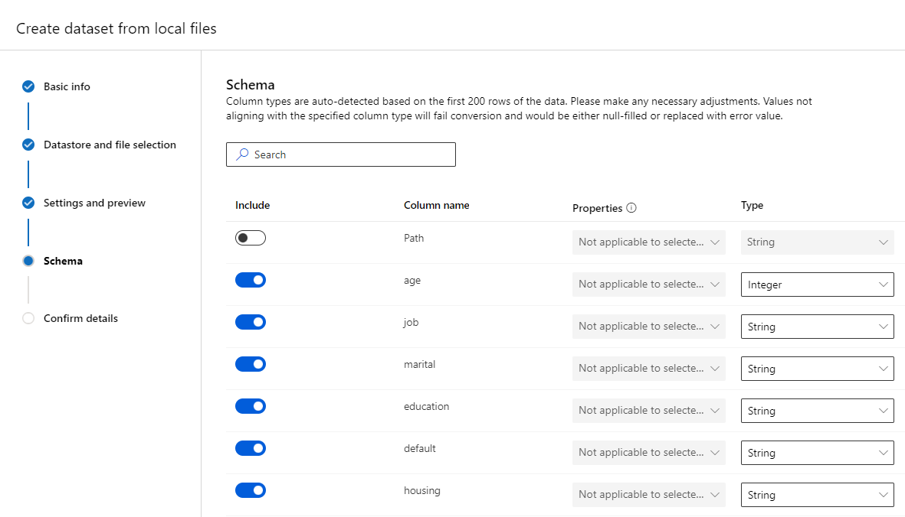

14. Check the information in the **Confirm details** tab and click **Create** 

    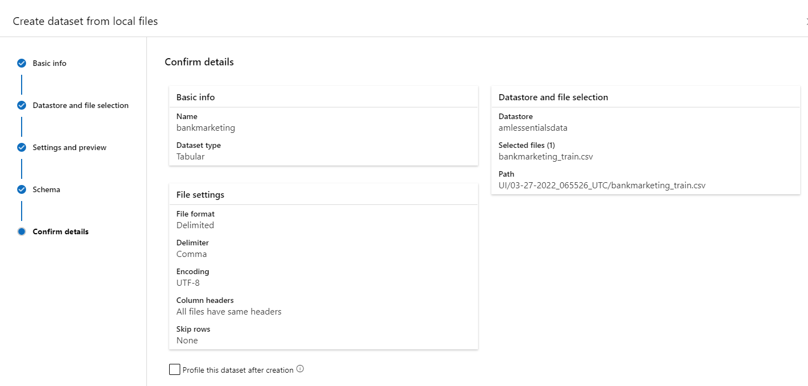

15. After the dataset has been created select it from the list of available datasets and click **next**

    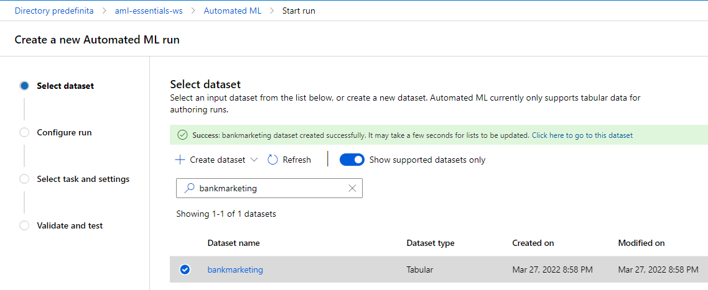

16. In the *Configure run* tab  provide the following information:
    1. Experiment name: Check **Create New**
    2. New Experiment name: *bankmarketing-automl-example*
    3. Target column: y (String)
    4. Select compute type: **Compute cluster**
    5. Select Azure ML compute cluster: select the compute cluster created in the [Lab 2](../LabM01_02/README.md)

    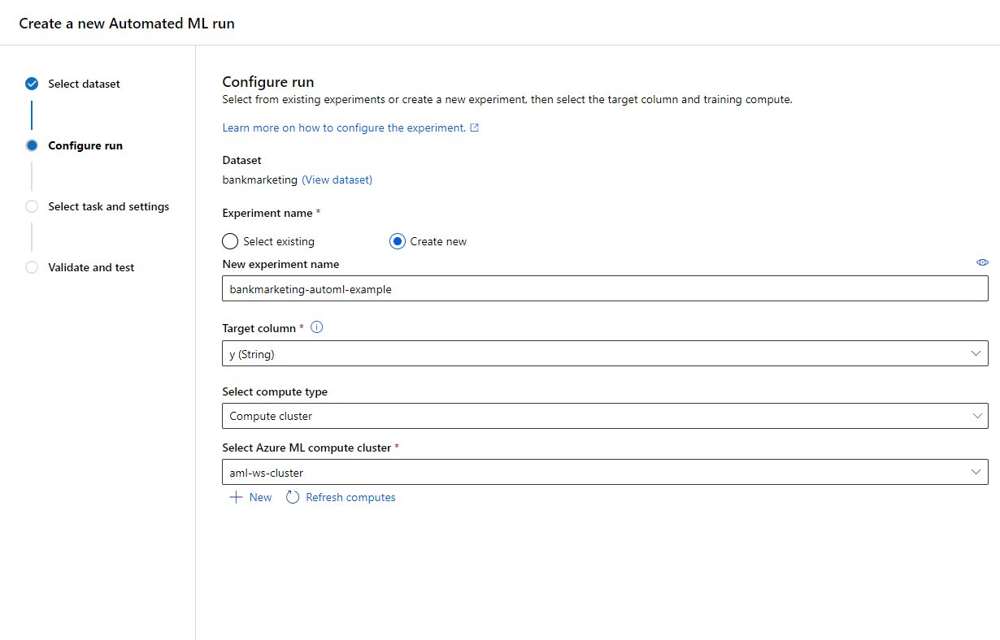

17. Click **next**
18. In the **Select task and settings** select classification and then click on **View additional configuration settings**

    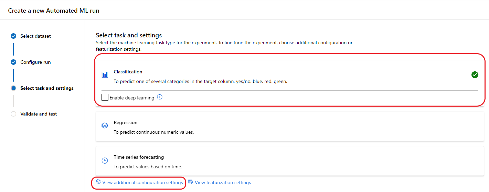

19. In the *Additional configuration*  provide the following information:
    1. Primary metric: **AUC weighted**
    2. Explain best model: flag this option
    3. Use all supported models: flag this option
    4. Training job time: 1
    5. Max concurrent iterations: 2
    
    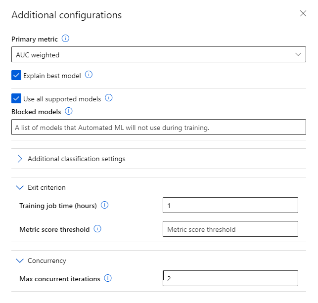

20. Click **Save** and then **Next**
21. In the **Validate and test** tab provide the following information
    1. Validation type: Train-validation split
    2. Percentage validation of data: 10
    3. Test dataset (preview): Test split (choose a percentage of the traning data)
    4. Pergentage test of data: 10

    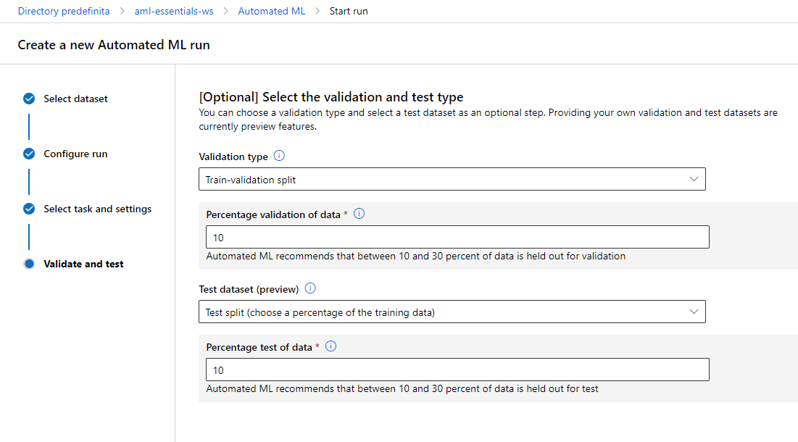

22. Click **Finish**

    Wait for the automl run to be finished

23. In the Azure Machine Learning Studio Page click on **Experiments** in the **Asset** section of the left-side menu click on the **bankmarketing-automl-example** and verify the result of the run

The lab is completed!

